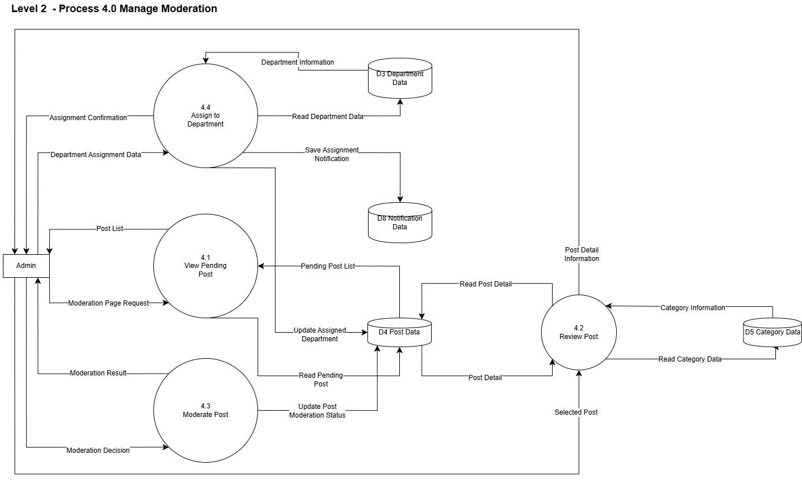

<div align="center">
  

  # RuangKita

  **A web-based platform for managing student aspirations, feedback, and organizational responses.**
</div>

RuangKita provides students with a structured and transparent channel to submit
aspirations, complaints, and suggestions. Each submission can be moderated,
prioritized through votes, discussed through comments, assigned for follow-up,
and tracked until it is resolved.

## Table of Contents

1. [Features](#features)
2. [Actors](#actors)
3. [DFD and System Flow](#dfd-and-system-flow)
4. [Folder Structure](#folder-structure)
5. [Tech Stack](#tech-stack)
6. [Database Management System](#database-management-system)
7. [Contributors and Role Division](#contributors-and-role-division)

## Features

- Authentication for students, administrators, and departments.
- Student registration and profile management.
- Submission of categorized aspirations with optional images or videos.
- Anonymous posting option.
- Moderation workflow for approving or rejecting new submissions.
- Public feed with search, category filters, pagination, and sorting by newest,
  popularity, or unresolved status.
- Upvote and downvote system with one vote per student on each post.
- Comment section for discussion and clarification.
- Status tracking: `Not Reviewed`, `In Process`, `Communicated`, `Resolved`,
  and `Rejected`.
- Notifications for status changes, official responses, and new comments.
- Administrative dashboard with statistics, filters, moderation controls,
  and priority indicators.
- Department dashboard for monitoring and updating approved aspirations.
- Status history through an audit log.

## Actors

| Actor | Responsibilities |
|---|---|
| **Student** | Registers and logs in, manages a profile, submits an aspiration, posts anonymously when needed, views the feed, votes, comments, receives notifications, and tracks progress. |
| **Admin / HMIF** | Reviews pending submissions, accepts or rejects posts, assigns or forwards approved aspirations, provides official responses, updates statuses, and monitors statistics. |
| **Department** | Views aspirations that have passed moderation, follows up on assigned or approved issues, adds notes, and updates progress to `In Process`, `Communicated`, or `Resolved`. |

## DFD and System Flow

<div align="center">
  
</div>

The Level 1 DFD shows how the three external actors, **Student**, **Admin**, and
**Department**, interact with the five main processes and the system's data
stores.

1. **Manage Authentication (1.0)**  
   Students submit registration or login data, while admins and departments
   submit login data. The system validates the information using the relevant
   student, admin, or department data store and returns the authentication
   result to each actor.

2. **Manage Aspiration Post (2.0)**  
   Students can create aspirations, request the feed, view post details, search
   and filter posts, or share them. The process reads and writes post data and
   uses category data to organize the aspirations before returning post, feed,
   and search results to students.

3. **Manage Interaction (3.0)**  
   Students send comment and vote requests for an aspiration. The system reads
   the related post, stores or retrieves comment and vote data, and returns the
   interaction result to the student.

4. **Manage Moderation (4.0)**  
   Admins request the list of posts awaiting review and submit moderation
   decisions. The process reads post and category data, updates the moderated
   post, reads department information, and records which department will handle
   an approved aspiration.

5. **Manage Status and Notification (5.0)**  
   Departments request assigned posts and submit status updates as the
   aspiration is handled. The process updates the post status, stores assignment
   or status notifications, and sends status or notification information to the
   student. Students can also request their latest post status and
   notifications.

The main data stores used in this flow are **Student Data (D1)**, **Admin Data
(D2)**, **Department Data (D3)**, **Post Data (D4)**, **Category Data (D5)**,
**Comment Data (D6)**, **Vote Data (D7)**, and **Notification Data (D8)**.

## Folder Structure

```text
RuangKita/
|-- App/
|   |-- admin/
|   |   |-- components/       # Reusable admin dashboard UI
|   |   |-- includes/         # Admin authentication and helpers
|   |   `-- queries/          # Admin database operations
|   |-- api/                  # Post, vote, status, profile, and notification APIs
|   |-- assets/
|   |   |-- admin/            # Admin-specific CSS and JavaScript
|   |   |-- CSS/              # Application stylesheets
|   |   `-- JS/               # Frontend scripts and API client
|   |-- auth/                 # Login, signup, logout, and department dashboard
|   |-- config/               # Database configuration
|   |-- image/                # Logos, UI images, and uploaded post media
|   |-- students/             # Student feed, profile, and create-post pages
|   `-- uploads/avatars/      # Uploaded profile pictures
|-- database/
|   `-- ruangkita.sql         # Database schema and initial accounts
|-- readme_assets/
|   |-- Level1_dfd.png        # Moderation data flow diagram
|   `-- RuangKita_Logo6.png   # README logo
|-- palette.txt               # Project color palette
`-- README.md
```

## Tech Stack

<div align="center">


</div>

| Layer | Technology |
|---|---|
| Frontend | HTML5, CSS3, JavaScript |
| Backend | PHP 8 and REST-style endpoints |
| Database | MySQL with SQL |
| Local Server | Apache through XAMPP |
| Database Access | PHP MySQLi with prepared statements |
| UI/UX Design | Figma |

## Database Management System

RuangKita uses **MySQL** as its relational DBMS. The connection is handled by
PHP through **MySQLi**, while the database definition is available in
[`database/ruangkita.sql`](database/ruangkita.sql).

| Table | Purpose |
|---|---|
| `students` | Stores student accounts, NIM, email, password, and profile picture. |
| `admins` | Stores administrator or HMIF accounts. |
| `departments` | Stores organizational department accounts. |
| `posts` | Stores aspiration content, category, attachment, anonymity flag, and current status. |
| `votes` | Stores one upvote or downvote per student for each post. |
| `comments` | Stores student discussions on aspirations. |
| `post_status_logs` | Records every status change, actor, note, and timestamp. |
| `admin_responses` | Stores official administrator responses. |
| `notifications` | Stores comment, response, and status-change notifications for students. |

Main relationships:

- One student can create many posts.
- One post can have many votes, comments, status logs, responses, and
  notifications.
- A student can only have one active vote on a post.
- Deleting a student or post cascades to related records where foreign keys
  are defined.

## Contributors and Role Division

| Contributor | Student ID | Role | Main Responsibilities |
|---|---|---|---|
| [Kanaya Salsabila Humaira](https://github.com/Cannaset) | F1D02410061 | Project Manager and Database Integration | Project planning, task distribution, timeline and progress monitoring, team coordination, database schema and relationships, frontend-backend integration, testing, feature validation, and documentation. |
| [Abdurrahman Karim](https://github.com/karimirim) | F1D02410031 | Frontend and UI Developer | Figma slicing, authentication UI, student feed, create-post page, responsive layouts, design consistency, frontend integration, user experience, and cross-device compatibility. |
| [Septania Sybil Shofiyah](https://github.com/NichtzaeL) | F1D02410094 | Backend and API Developer | Authentication, post CRUD, voting, comments, notifications, status APIs, database connectivity, business logic, server-side validation, security, and data communication. |

## Author Notes
This project was developed as part of the final project requirement for the Web Programming course. It presents the implementation of RuangKita, a web-based information system designed to manage student aspirations, feedback, and responses in a transparent and structured manner, improving communication between students and university stakeholders.
